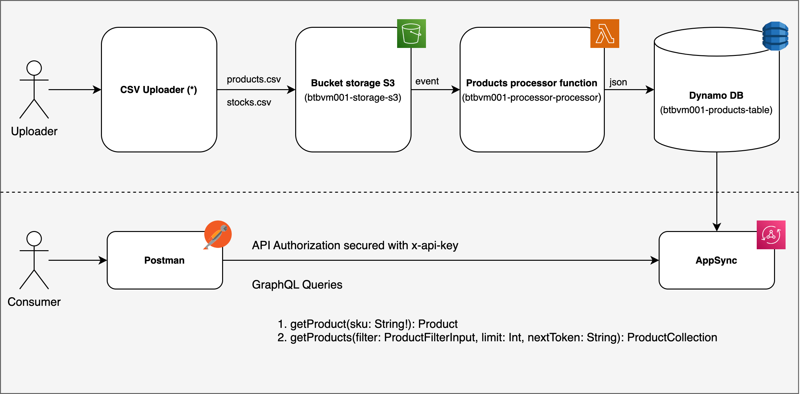
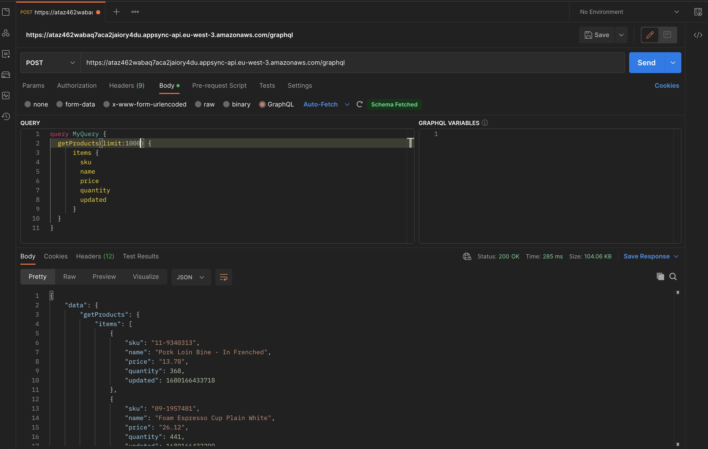

# AWS serverless test

## 1. Solution design



The proposed solution is designed to ensure the storage of two types of .csv files and make the data available to the user through a GraphQL API protected by an API key.

The file types are:
- **Products** with properties sku, name, price
- **Stocks with** properties sku, quantity


The loading of the files into their respective Buckets is ensured by a CSV-Uploader, which ideally should be a web interface, but in this case, it is a simple JavaScript script.

Loading the file into the respective bucket triggers an event that calls a **Lambda function**.

The Lambda function's task is to read the .csv file, verify that it is well-formed, parse it into .json format, and then send the various elements to the appropriate DynamoDB table. The function's standard output is saved in **CloudWatch**.

**AppSync** is the AWS service dedicated to exposing GraphQL endpoints. AppSync performs mapping and makes the indexed results available to an https client (e.g., Postman).


## 2. How to run the code

### 2.1 Deploy 
Before proceeding, make sure you have installed 
[aws-cli](https://docs.aws.amazon.com/cli/latest/userguide/getting-started-install.html), [sam-cli](https://docs.aws.amazon.com/serverless-application-model/latest/developerguide/install-sam-cli.html) and [Node 18x](https://nodejs.org/en).

 The code for deploying the solution is contained within the ```Processor``` folder.

To deploy the code, execute the following commands:

```bash
cd Processor
sam build
sam deploy --guided --capabilities CAPABILITY_NAMED_IAM
```

Then, follow the guided procedure on the terminal and wait for confirmation that all components have been successfully deployed.

### 2.2 Upload CSV
It is possible to upload the ```products.csv``` and ```stocks.csv``` files using the script located in the ```Uploader``` folder.

Before running the commands for file upload, a ```.env``` file, that contains the bucket names, **MUST BE CREATED** in the Uploader folder. Below is an example of the ```.env``` file.

```txt
PRODUCTS_BUCKET_NAME="<<INSERT PRODUCTS BUCKET NAME HERE>>"
STOCKS_BUCKET_NAME="<<INSERT STOCKS BUCKET NAME HERE>>"
```

To upload the files run the following commands:
```bash 
cd Uploader
npm install
npm run upload
```

### 2.3 GraphQL queries

After the successful completion of the .csv upload, it is possible to query the API. To configure the HTTP client, we need to obtain the endpoint and secret_key from the AppSync component page as shown in the following image. 


Then, we will enter them into Postman. 


Below are some examples of queries.



## 3. Technical debts
- [ ] Implementation of a web interface for file upload
- [ ] Lambda function optimization: The code for the two lambda functions is repeated and should be consolidated into a shared function.
- [ ] Security improvement. Switch to AppSync API_KEY authentication to AWS Cognito. 
  - [ ] In AppSync, it's possible to use Cognito as an authentication provider to authenticate and authorize API calls to your AppSync API. This enables you to control access to specific fields or types based on user roles, and also allows you to track user activity and enforce security policies. 
  - [ ] It can be possible to use Cognito to control access to your S3 buckets.
- [ ] Plan for deployment in environments (dev, test, quality, prod)
- [ ] Improve integration with Cloudwatch for logging
- [ ] Implement filters for GraphQL queries (getProducts, getStocks)


